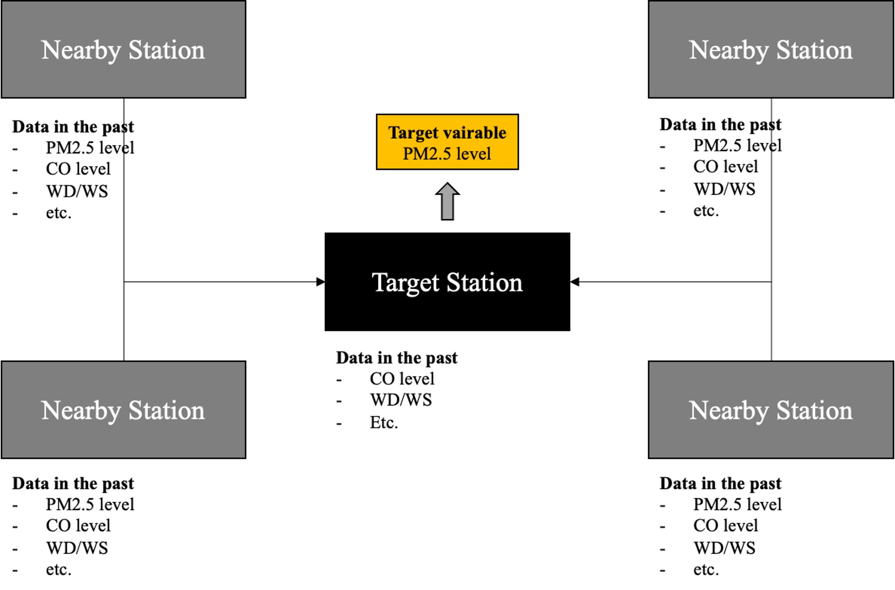
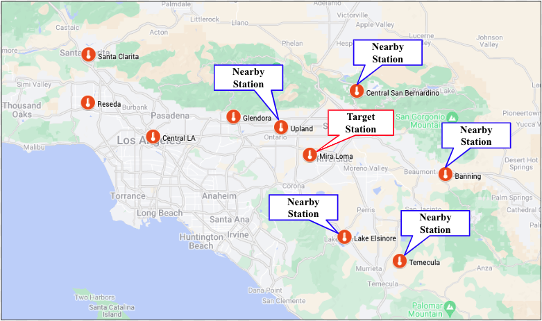
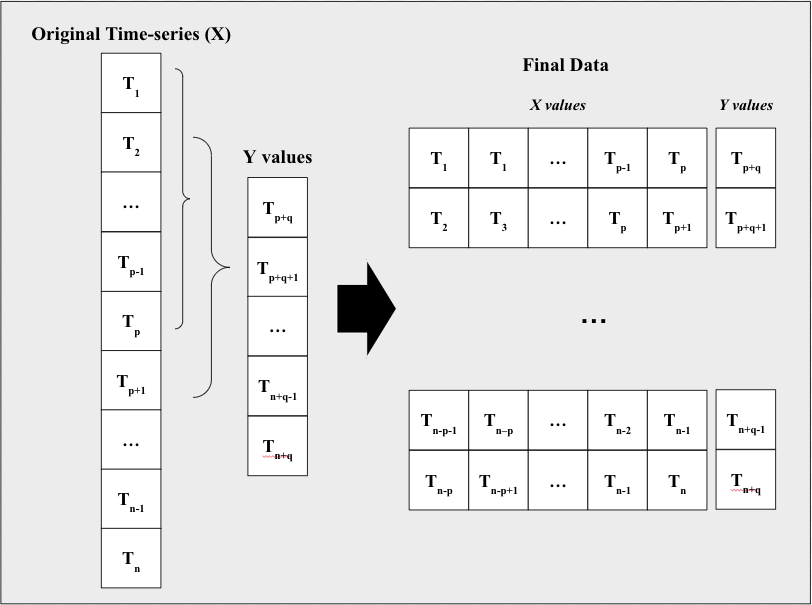
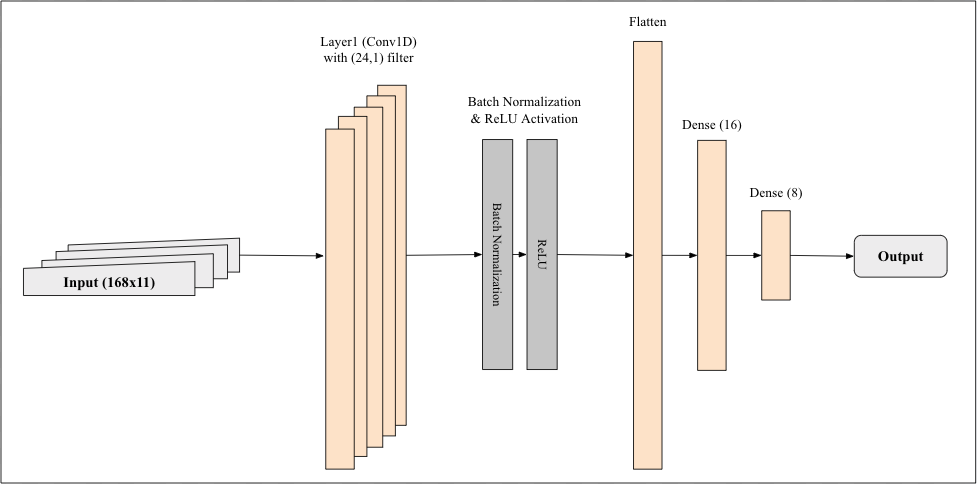

# Forecasting of PM2.5 level at an AQMD station: using nearby stations’ data

### Background
- This project is the final project of Machine Learning course (CSCA 5622) at University of Colorado Boulder.
- Team members are Nitish Venkatesh Septankulam Ramakrishnan, Meghana Vasanth Shettigar, and Jooseok Lee.
- Simplified from the original one.

### Overview
- In this project, we aim to develop a machine learning model that can predict the level of PM2.5 of stations that have no PM2.5 level monitoring capability. 
- To achieve that, we build a machine learning model that predicts the PM2.5 level of a target station using PM2.5 level data of nearby stations. 
- We also utilize other commonly monitored air pollution data, such as level of NO2 and CO, and basic meteorological data, such as wind direction and speed, to increase the performance of the model. 
- The development direction is based on the assumption that the air quality of one station has a spatiotemporal correlation to the air quality of nearby stations.

### Apporach
- In this project, we aim to develop a machine learning model that can predict the level of PM2.5 of stations that have no PM2.5 level monitoring capability. 
- In order to do this, we build a CNN-based machine learning model that take nearby stations’ data as input and predict the target station’s PM2.5 level.  

    

### Target and Nearby Stations
- We select Mira Loma station as our target station and five other stations (i.e. Upland, LakeElsinore, Temecula, Banning, and Central San Bernardino stations) as nearby stations. 
- The selection criteria is the number of missing values in PM2.5 and proximity).

    

### Data Preprocessing
- We aim to build machine learning models that predict the PM2.5 level after six steps (i.e. after six hours) using the previous seven days’ data (i.e. 168 hours of past data). 
- To achieve this, we add an additional preprocessing step to change the shape of data into the desired one.

    

### Building CNN Model
- This model has one 1D convolutional layer. 
- It has a kernel size of (24,) and 12 channels. 
- The batch normalization is done after the convolutional layer followed by RELU activation. 
- Then, the AveragePooling1D layer and Flatten layer are applied to the model. 
- Finally, two Dense layers, Dense(16) and Dense(8) respectively, are applied to produce the final output.  
- Adam optimizer with learning rate  0.001 and MSE loss function are used to train the model. 
- The CNN structure we used in this project is selected after trying several different options, such as increasing the number of 1D convolutional layers, changing the size of kernel and channels, or changing the learning rate. 

    

### Model Evaluation
- We use three kinds of evaluation metrics, namely mean absolute error (MAE), mean squared error (MSE), and R^2 to evaluate the model. 

### Discussion
- In this project, we aim to build a machine learning model that predicts the level of PM2.5 of a target station using nearby stations’ PM2.5 data. 
- The result showed that machine learning models that do not use the target station’s PM2.5 data show comparable performance to the models that use the target station’s PM2.5 data.
- It showed the possibility of utilizing our approach to estimate the PM2.5 level of stations that do not have the capability to measure it. 
- However, there are some limitations that should be overcome. 
- First of all, the overall performance of models we developed showed pretty low performance. 
- The R2 of the best model we developed was 0.4552, which is quite low. According to the result of [2], which showed higher MSE in predicting the level of PM2.5 in China, it seems that predicting the future level of PM2.5 is quite a complex and difficult problem.  
- To make the proposed approach practical, it is necessary to increase the R2 of prediction models. 
- According to the error analysis, the prediction models seem to show lower performance on high levels of PM2.5. 
- We might need to build an additional model specialized in handling higher levels of PM2.5. 